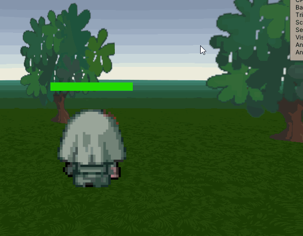

# DirectionalSpriteShader
Shader created using shadergraph which implements billboarding and sprite selection from a spritemap according to the position of the camera and its angle

WIP: need to remap offset depending on angle between camera and object. I'd also like to handle animation (I'm thinking a x offset according to a periodicity and time elapsed could be good enough?)  

